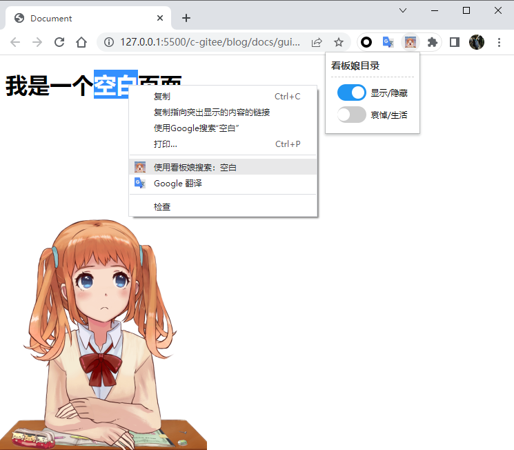
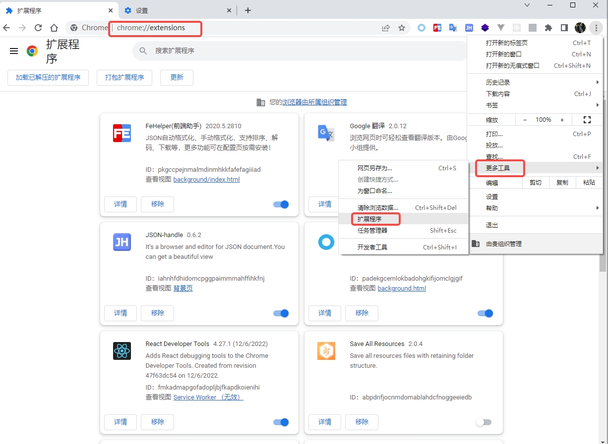
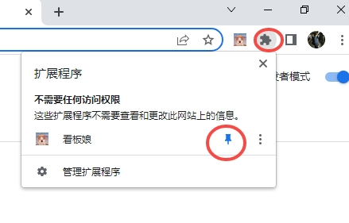
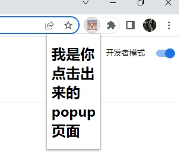
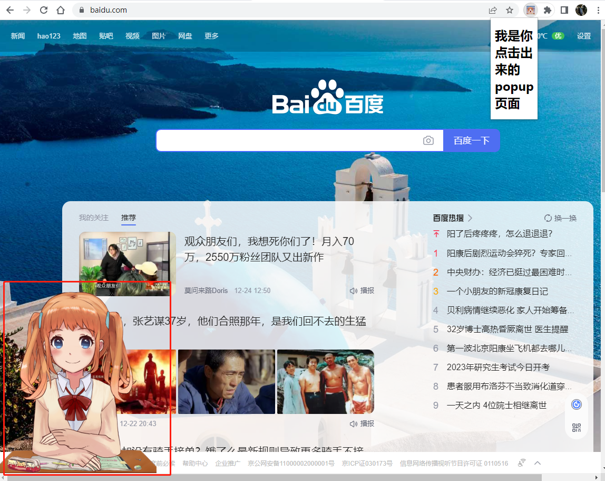
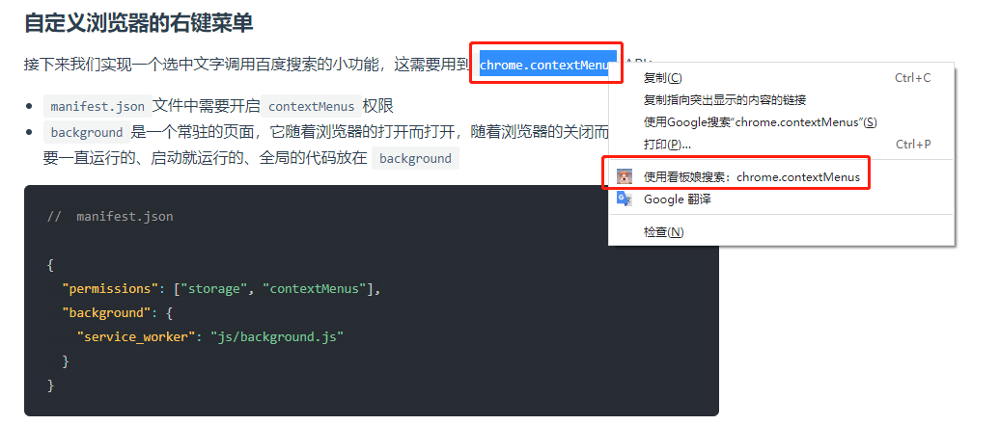
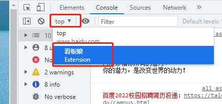
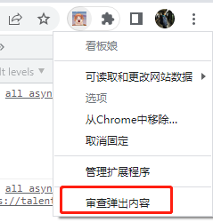
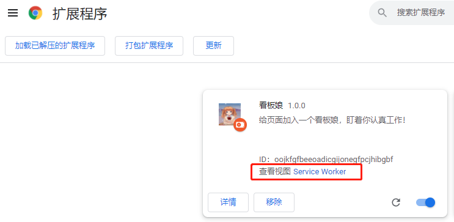

# 从零开发一个 Chrome 扩展程序(自动给网页加个看板娘，盯着你认真工作/摸鱼)

## 前言

本文打算实现一个自动给网页添加一个看板娘的扩展，可以显示/隐藏， 并且有持久化记录功能；根据网页的`href`记录是否开启看板娘；以及鼠标选中文本出现扩展自定义的 `menu`事件；如图所示：



### 什么是 Chrome 扩展程序？

Chrome 扩展程序（`Chrome-extensions`），也俗称`Chrome插件`，下面我简称`Chrome扩展`，它可以增强浏览器的功能，让用户对自己的浏览器实现`定制化`，`DIY`的快乐懂得都懂（`DDDD`）

### 怎样查看自身安装的扩展？

我们可以通过点击 `更多工具 -> 扩展程序`来打开扩展程序标签页， 在标签页中查看我们所有安装的扩展，或者在顶部地址栏输入`chrome://extensions/`打开。 如图所示：



### 怎样获取扩展程序？

大多数`Chrome`用户从[Chrome 应用商店](https://chrome.google.com/webstore/category/extensions)获得扩展程序。世界各地的开发人员会在`Chrome应用商店`中发布他们的扩展，经过 `Chrome` 的审查并最终向用户提供

- 由于一些众所周知的原因，我们并不能访问`Chrome应用商店`， 但是`Chrome`又要求`扩展`必须从它的`Chrome应用商店`下载安装，这成了一个死循环，不过`只要思想不滑坡，方法总比困难多`，下面我会讲解如何从本地加载扩展，

- 我们只要在能访问的网站上[extfans.com](https://www.extfans.com/)下载需要的扩展，再打开`扩展程序标签页`，打开右上角的`开发者模式`开关，再把下载好的压缩包解压，解压后会看到一个`.crx`后缀的文件，将文件拖拽到`扩展程序标签页`即可。

[可以点击这里查看图文教程](https://www.maxiaobang.com/2433.html)

## 开始

### 实现简易 demo

我们新建一个文件夹`demo`，在文件夹内创建一个`manifest.json`配置文件：

```json
{
  // manifest的版本号，主流是2，在2024年彻底不支持，最新版本是3，
  "manifest_version": 3,
  // 扩展名称
  "name": "看板娘",
  // 扩展版本
  "version": "1.0.0",
  // 扩展描述
  "description": "给页面加入一个看板娘，盯着你认真工作！"
}
```

`manifest_version`版本号 `2` 跟 `3` 的 API 会有较大差别；请注意区分：

[点击这里查看官方文档](https://developer.chrome.com/docs/extensions/mv3/intro/)

扩展可以点击右上角扩展图标来弹出一个小窗口的页面，焦点离开时窗口页面关闭，一般做一些临时性的交互操作；在配置文件中新增 `icon`字段，配置图标，新增 `action` 字段，配置 `popup` 弹框：

```json
{
  "manifest_version": 3,
  "name": "看板娘",
  "version": "1.0.0",
  "description": "给页面加入一个看板娘，盯着你认真工作！",
  // 图标，扩展程序列表内的图标，我全部用一个尺寸；文章最后会提供资源文件的链接
  "icons": {
    "16": "img/live2d.png",
    "48": "img/live2d.png",
    "128": "img/live2d.png"
  },
  // 右上角图标、可根据规则高亮或置灰: 默认高亮
  "action": {
    "default_icon": "img/live2d.png",
    "default_title": "这是自己开发的一个Chrome扩展",
    "default_popup": "html/popup.html"
  }
}
```

我们创建一下`popup.html`

```html
<!DOCTYPE html>
<html lang="en">
  <head>
    <title>Document</title>
  </head>
  <body>
    <h1>我是你点击出来的popup页面</h1>
  </body>
</html>
```

> 提示： 我们在`扩展程序标签页`记得打开右上角的 `开发者模式` 开关

此时；我们在`扩展程序标签页`点击左上角的`加载已解压的扩展程序`按钮，找到我们创建的这个`demo`文件夹，点击`选择文件夹`；扩展便成功出现在你 `扩展程序标签页中`；如图所示：

> 提示：记得开启卡片右下角的开关，下图第二个红框


我们继续点击右上角的`扩展程序图标`，会弹出你安装的所有扩展，我们点击第二个红框的图标；扩展便出现在了`扩展图标`的左侧； 如下图所示：



点击看板娘图标便出现`popup.html`页面；如下图所示：



此时我们便成功开发了一个最简单的`Chrome扩展程序`，接下来，我们正式开发标题所说的`看板娘扩展`

### 实现看板娘扩展

我们打算在页面中自动生成一个看板娘，那便需要往网页中注入`生成看板娘的代码文件`，这需要用到`content_scripts`API：

```json
{
  "content_scripts": [
    {
      // 匹配规则：匹配所有url
      "matches": ["<all_urls>"],
      // 多个js会按顺序注入
      "js": ["js/live2d.min.js", "js/live2d.0.min.js", "js/init.js"],
      // 代码注入的时间，可选值： "document_start", "document_end",  "document_idle"
      // document_idle 表示页面空闲时; 默认就是document_idle
      "run_at": "document_idle"
    }
  ]
}
```

- `live2d.min.js` 看板娘文件 1
- `live2d.0.min.js` 看板娘文件 2
- `init.js` 初始化看板娘

```js
// init.js

live2dWidget.init({
  model: {
    jsonPath: 'https://unpkg.com/live2d-widget-model-shizuku@1.0.5/assets/shizuku.model.json',
  },
  display: {
    superSample: 2,
    width: 300,
    height: 400,
    position: 'left',
    hOffset: 0,
    vOffset: 0,
  },
})
```

此时，打开任意网页，便能在左下角看到一个可爱的看板娘了。如图所示：



下面我们优化一下这个扩展，目前我们只能无差别的展示看板娘，我们想在右上角的`popup.html`页面上控制看板娘的`显示/隐藏`,并且`显示/隐藏`状态可以被**持久化**记录；这用到了几个 API：`chrome.storage.local`、`chrome.tabs.query`、`chrome.tabs.sendMessage`

由于用到了`chrome.storage`, 所以要在 `manifest.json`文件中添加以下权限：

```json
{
  "permissions": ["storage"]
}
```

下面我们改造一下`popup.html`:

```html
<!DOCTYPE html>
<html lang="en">
  <head>
    <title>Document</title>
    <style>
      /* ... */
    </style>
  </head>
  <body>
    <h1 class="title">看板娘目录</h1>
    <div class="switch-item">
      <label class="switch" id="switch-live2d">
        <input class="checkbox" type="checkbox" checked />
        <div class="slider"></div>
      </label>
      <span class="text">显示/隐藏</span>
    </div>
    <!-- 注意只能使用外部script -->
    <script src="../js/popup.js"></script>
  </body>
</html>
```

```js
// popup.js

const GET_LOCATION_HREF = 'get-location-href'
const TOGGLE_LIVE2D = 'toggle-live2d'
const live2dDom = document.getElementById('switch-live2d')

initLive2dStatus()

/**
 * 添加change事件
 */
live2dDom.addEventListener('change', async (event) => {
  const status = event.target.checked
  const message = {
    cmd: TOGGLE_LIVE2D,
    status,
  }

  const { href } = await sendMessageToInitScript(message)
  chrome.storage.local.set({ [href + TOGGLE_LIVE2D]: status })
})

/**
 * 初始化看板娘状态
 */
async function initLive2dStatus() {
  const localStorage = await chrome.storage.local.get()
  const message = {
    cmd: GET_LOCATION_HREF,
    storage: localStorage,
  }

  const { href } = await sendMessageToInitScript(message)
  const status = localStorage[href + TOGGLE_LIVE2D]

  if (status) {
    live2dDom.children[0].checked = true
  } else {
    live2dDom.children[0].checked = false
  }
}

/**
 * 发送消息到init.js
 * @param {*} message
 * @returns
 */
async function sendMessageToInitScript(message) {
  const tabList = await chrome.tabs.query({ active: true })
  const response = await chrome.tabs.sendMessage(tabList[0].id, message)
  return response
}
```

`init.js`修改如下：

```js
const GET_LOCATION_HREF = 'get-location-href'
const TOGGLE_LIVE2D = 'toggle-live2d'

/**
 * @description: 初始化
 */
live2dWidget.init({
  // ...
})

/**
 * 在下一轮事件循环动作，确保DOM已经生成
 */
setTimeout(() => {
  const href = location.href
  const status = localStorage.getItem(href + TOGGLE_LIVE2D)
  toggleLive2d(+status)
}, 0)

addListener()

/**
 * 添加监听
 * @returns
 */
function addListener() {
  chrome.runtime.onMessage.addListener((request, sender, sendResponse) => {
    const { cmd, storage, status } = request
    const href = location.href

    if (cmd === GET_LOCATION_HREF) {
      sendResponse({ href })
      toggleLive2d(storage[href + TOGGLE_LIVE2D])
      return
    }

    if (cmd === TOGGLE_LIVE2D) {
      sendResponse({ href })
      toggleLive2d(status)
      localStorage.setItem(href + TOGGLE_LIVE2D, +status)
      return
    }
  })
}

/**
 * 开关看板娘
 * @returns
 */
function toggleLive2d(status) {
  const ele = document.getElementById('live2d-widget')

  if (!ele) {
    console.error('liveDom is undefined')
    return
  }

  if (status) {
    ele.style.display = 'block'
  } else {
    ele.style.display = 'none'
  }
}
```

到这一步，带有控制开关以及记忆功能的`Chrome扩展`便开发完毕了！

### 自定义浏览器的右键菜单



接下来我们实现一个选中文字调用百度搜索的小功能，这需要用到`chrome.contextMenus`API：

- `manifest.json`文件中需要开启`contextMenus`权限
- `background`是一个常驻的页面，它随着浏览器的打开而打开，随着浏览器的关闭而关闭，通常把需要一直运行的、启动就运行的、全局的代码放在 `background`

```json
//  manifest.json

{
  "permissions": ["storage", "contextMenus"],
  "background": {
    "service_worker": "js/background.js"
  }
}
```

```js
// background.js

chrome.contextMenus.create({
  id: chrome.runtime.id,
  title: '使用看板娘搜索：%s', // %s 表示选中的文本
  contexts: ['selection'], // selection 表示选中事件
})

chrome.contextMenus.onClicked.addListener((info, tab) => {
  chrome.tabs.create({
    url: 'https://www.baidu.com/s?ie=utf-8&wd=' + encodeURI(info.selectionText),
  })
})
```

### 调试方式

| 文件类型          | 调试方式                                   | 图片说明                                                     |
| ----------------- | ------------------------------------------ | ------------------------------------------------------------ |
| `content_scripts` | 打开 `Console`,如图切换                    |      |
| `popup`           | 鼠标右键点击扩展图标，然后点击审查弹出内容 |  |
| `background`      | 扩展管理页点击`Service Worker`即可         |   |

## 结束

- [资源地址](https://github.com/au1996/chrome-extensions)
- [官方文档](https://developer.chrome.com/docs/extensions/mv3/)
