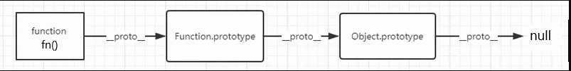
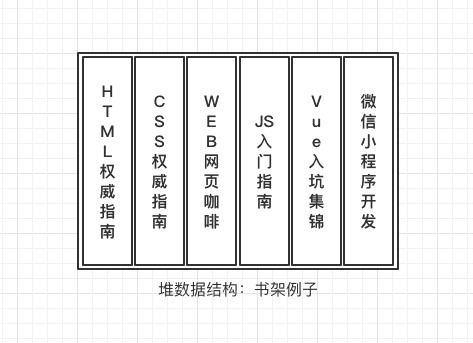
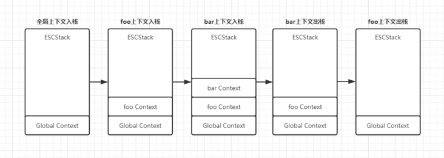
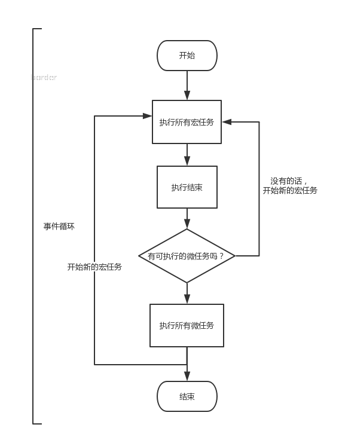
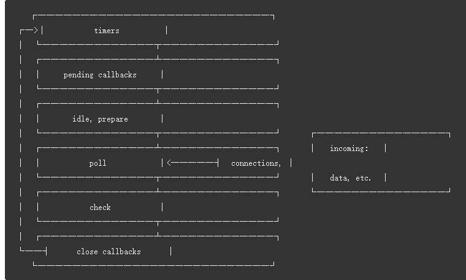

# 【js 进阶】全篇干货 ！一篇文章让你彻底弄懂栈、堆、队列、执行栈、执行上下文、跟事件循环（Event Loop）的关系

## 前言（本文背景）

网上有很多讲解 `Event Loop` 的文章，但大多数都过于片面，少数相对全面的也仍有一些知识盲区，甚至一些文章还传播错误的知识，结果就是让我们 `似懂非懂`。这篇文章让你彻底弄懂！

## 开始（前置知识点）

已经了解 `JS数据类型`、`栈`、`堆`、`队列`、`执行栈`、`执行上下文` 的同学可以跳过这一段；

### JS 数据类型

JS 数据类型分为两大类：`原始类型 | 基本类型` 、`引用类型`

原始类型包含七种：

- `number`
- `string`
- `boolean`
- `undefined`
- `symbol (ES2015)`
- `bigint (ES2020)`
- `null (特殊的原始类型)`

```js
typeof 666 === 'number' // true
typeof 'str' === 'string' // true
typeof false === 'boolean' // true
typeof undefined === 'undefined' // true
typeof Symbol('sym') === 'symbol' // true
typeof 666n === 'bigint' // true
typeof null === 'object' // true

// 原理是这样的，不同的对象在底层都表示为二进制，
// 在 JavaScript 中二进制前三位都为 0 的话会被判断为 object 类型，
// null 的二进制表示是全 0，自然前三位也是 0，所以执行 typeof 时会返回“object”
```

引用类型只有一种 `Object`：

- `Object`

```js
const fn = (x) => x
fn instanceof Function // true
fn instanceof Object // true
```

所以 `Function` 算是 `Object` 的子类型, 这涉及到 `原型链` 的知识点



其实 `Object` 还包含很多子类型，比如 `Array`、`RegExp`、`Math`、`Map`、`Set`、`WeakMap`、`WeakSet` 等

**特殊提示**：为了方便操作原始类型，`ECMAScript` 提供了 `3` 种特殊的引用类型：`Number`、`String` 和`Boolean`。
这些类型具有上面介绍的其他`引用类型`一样的特点，但也具有与各自`原始类型`对应的`特殊行为`。每当用到某个`原始类型`的方法或属性时，
后台都会创建一个相应`原始包装类型`的对象，从而暴露出操作`原始类型`的各种方法。来看下面的例子：

```js
let s1 = 'some text'
let s2 = s1.substring(2)

// 上面等同于下面的操作
let s1 = new String('some text')
let s2 = s1.substring(2)
s1 = null

// 举例1
let s1 = 'some text'
s1.color = 'red'
console.log(s1.color) // undefined
// 原因就是第二行代码运行时会临时创建一个String对象，而当第三行代码执行时，这个对象已经被销毁了
// 实际上，第三行代码在这里创建了自己的String 对象，但这个对象没有color 属性。

// 举例2
let obj = new Object('some text')
console.log(obj instanceof String) // true
// 如果传给 Object 的是字符串，则会创建一个 String 的实例。

// 举例3
let value = '25'
let number = Number(value) // 转型函数
console.log(typeof number) // "number"
let obj = new Number(value) // 构造函数
console.log(typeof obj) // "object"
// 如果是数值，则会创建 Number 的实例。布尔值则会得到 Boolean 的实例。

// 举例4
let falseObject = new Boolean(false)
let result = falseObject && true
console.log(result) // true

let falseValue = false
result = falseValue && true
console.log(result) // false

console.log(typeof falseObject) // object
console.log(typeof falseValue) // boolean
console.log(falseObject instanceof Boolean) // true
console.log(falseValue instanceof Boolean) // false
```

上面 `3` 种特殊的引用类型：`Number`、`String` 和`Boolean` 可能给你增加了心智负担，我很抱歉~但这是一个有趣的事实 O(∩_∩)O

### 栈（stack）

`栈`（stack） 、`堆`（heap）、 `队列`（queue）是 `js` 的三种数据结构

**栈的特点是：出口跟入口是同一个，遵循着 `先进后出`、`后进先出` 的原则。数据只能顺序的入栈，顺序的出栈。**

一图胜千言：


### 堆（heap）

**堆的特点是 `无序` 的 `key-value` `键值对` 存储方式。**

堆的存取方式跟 **顺序** 没有关系，不局限 **出入口**。

一图胜千言：



我们想要在书架上找到想要的`书籍`，最直接的方式就是通过查找`书名`，书名就是我们的 `key`。拿着这把 `key`，就可以轻松拿到对应的`书籍`。

```
这里提一句网上流传的知识点：
javascript代码在执行的时候会将不同的变量存于内存中的不同位置
栈内存：存放原始数据类型 以及 引用数据类型的指针
堆内存：存放引用数据类型的值

请注意：不存在闭包的时候，上面的结论是对的。
但是存在闭包时， `闭包` 用到的变量（原始数据类型、引用数据类型）
都会存到 [[Scopes]]（函数的属性---存着这个函数的闭包链---其中的Closure代表闭包）中，
然后放到 堆内存，为了不增加心智负担，这篇文章不讲闭包。
```

感兴趣的同学可以点击[MDN 了解闭包](https://developer.mozilla.org/zh-CN/docs/Web/JavaScript/Closures)

**下图助你理解 `栈内存`、`堆内存`**：


**为什么会有栈内存和堆内存之分？**

通常与垃圾回收机制有关。为了使程序运行时占用的内存最小。

当一个方法执行时，每个方法都会建立自己的内存栈，在这个方法内定义的变量将会逐个放入这块栈内存里，随着方法的执行结束，这个方法的内存栈也将自然销毁了，内存栈里面的数据就清空了`(闭包是个例外，内存栈销毁了，但是闭包如果用到了内存栈里面的数据，闭包会把数据存下来。所以说： 闭包不能乱用)` 。因此，所有在方法中定义的变量都是放在栈内存中的；

当我们在程序中创建一个对象时，这个对象将被保存到运行时数据区中，以便反复利用（因为对象的创建成本通常较大），这个运行时数据区就是 `堆内存` 。`堆内存` 中的对象不会随方法的结束而销毁，即使方法结束后，这个对象还可能被另一个引用变量所引用，则这个对象依然不会被销毁，只有当一个对象没有任何引用变量引用它时，系统的垃圾回收机制才会在某个时机的时候回收它。（具体看 `JS运行环境` 的垃圾回收机制）

### 队列（queue）

**队列的特点是是 `先进先出`，数据存取时 "从队尾插入，从队头取出"。**

与栈的区别：栈的存入取出都在顶部一个出入口，而队列分两个，一个出口，一个入口

一图胜千言：


### 执行栈（JS stack）

`执行栈` 又称为 `执行上下文栈` 或 `调用栈`

程序执行进入一个执行环境时（比如整个 `script标签` 或 `进入一个函数内部`），它的 `执行上下文` 就会被创建，执行上下文中包含了函数的`参数`和`局部变量`,
并被推入 `执行栈` 中(入栈)；程序执行完成后，它的执行上下文就会被销毁，并从栈顶被推出(出栈)，继续执行下一个`执行上下文`。

因为 `JS` 执行中最先进入`全局环境`，所以最开始处于 **栈底的是全局环境的执行上下文** 。而处于 **栈顶的是当前正在执行函数的执行上下文**，当函数调用完成后，它就会从栈顶被推出。

**请注意：** 上面提到的`栈内存`，其实包含在`执行栈`里面，或者说，`栈内存`就是`执行栈`，只不过上面讲`栈内存`的时候没有讲`执行上下文`的概念。

```js
function foo() {
  function bar() {
    var str = 'string'
    console.log('I am bar')
  }
  bar()
}
foo()
```

一图胜千言：



### 执行上下文

**概念：以下内容摘抄自 `《JavaScript高级程序设计---第4版》` 中的第 4 章，第 2 节**

执行上下文（以下简称“上下文”）的概念在 `JavaScript` 中是颇为重要的。变量或函数的上下文决定了它们可以访问哪些数据，以及它们的行为。
每个上下文都有一个关联的变量对象`（variable object）`，而这个上下文中定义的所有变量和函数都存在于这个对象上。虽然无法通过代码访问变量对象，但后台处理数据会用到它。

全局上下文是最外层的上下文。根据 `ECMAScript` 实现的宿主环境，表示全局上下文的对象可能不一样。
在浏览器中，全局上下文就是我们常说的 `window` 对象（第 12 章会详细介绍），因此所有通过 `var` 定
义的全局变量和函数都会成为 `window` 对象的属性和方法。使用 `let` 和 `const` 的顶级声明不会定义在全局上下文中，但在作用域链解析上效果是一样的。
上下文在其所有代码都执行完毕后会被销毁，包括定义
在它上面的所有变量和函数（全局上下文在应用程序退出前才会被销毁，比如关闭网页或退出浏览器）。

每个函数调用都有自己的上下文。当代码执行流进入函数时，函数的上下文被推到一个`执行栈`上。
在函数执行完之后，`执行栈`会弹出该函数上下文，将控制权返还给之前的执行上下文。`ECMAScript`
程序的执行流就是通过这个`执行栈`进行控制的。

上下文中的代码在执行的时候，会创建变量对象的一个`作用域链`（scope chain）。这个作用域链决定
了各级上下文中的代码在访问变量和函数时的顺序。代码正在执行的上下文的变量对象始终位于作用域
链的最前端。如果上下文是函数，则其活动对象（activation object）用作变量对象。活动对象最初只有
一个定义变量：`arguments`。（全局上下文中没有这个变量。）作用域链中的下一个变量对象来自包含上
下文，再下一个对象来自再下一个包含上下文。以此类推直至`全局上下文`；`全局上下文`的变量对象始终
是`作用域链`的最后一个变量对象。

代码执行时的`标识符`解析是通过沿作用域链逐级搜索`标识符`名称完成的。搜索过程始终从作用域链
的最前端开始，然后逐级往后，直到找到`标识符`。（如果没有找到`标识符`，那么通常会报错。）

**大白话**：所谓 `执行上下文`，就是指 `一段代码`。这里只能打比方了，别问我为啥要打 `比方`

```js
// 在上面的 执行栈 例子中

// 全局执行上下文是这个
function foo() {
  function bar() {
    var str = 'string'
    console.log('I am bar')
  }
  bar()
}
foo()

// foo()创造的执行上下文是这个
function bar() {
  var str = 'string'
  console.log('I am bar')
}
bar()

// bar()创造的执行上下文是这个
var str = 'string'
console.log('I am bar')

// 每个上下文都拥有一个作用域链、用于搜索变量和函数、还有一些比如this等, 需要抽象的理解~.~
```

### 前置知识点总结

**以下内容摘抄自 `《JavaScript高级程序设计---第4版》` 中的第 4 章，第 4 节**

- 原始值大小固定，因此保存在栈内存上
- 从一个变量到另一个变量复制原始值会创建该值的第二个副本
- 引用值是对象，存储在堆内存上
- 包含引用值的变量实际上只包含指向相应对象的一个指针，而不是对象本身
- 从一个变量到另一个变量复制引用值只会复制指针，因此结果是两个变量都指向同一个对象
- `typeof` 操作符可以确定值的原始类型，而 `instanceof` 操作符用于确保值的引用类型
- 任何变量（不管包含的是原始值还是引用值）都存在于某个执行上下文中（也称为作用域）。这个上下文（作用域）决定了变量的生命周期，以及它们可以访问代码的哪些部分
- 执行上下文分`全局上下文`、`函数上下文`和`块级上下文`
- 代码执行流每进入一个新上下文，都会创建一个`作用域链`，用于搜索变量和函数
- 函数或块的`局部上下文`不仅可以访问自己作用域内的变量，而且也可以访问任何`包含上下文`乃至`全局上下文`中的变量
- 全局上下文只能访问`全局上下文`中的变量和函数，不能直接访问局部上下文中的任何数据
- 变量的执行上下文用于确定什么时候`释放内存`
- `JavaScript` 是使用垃圾回收的编程语言，开发者不需要操心内存分配和回收。`JavaScript` 的垃圾回收程序可以总结如下
- 离开作用域的值会被自动标记为可回收，然后在垃圾回收期间被删除
- 主流的垃圾回收算法是标记清理，即先给当前不使用的值加上标记，再回来回收它们的内存
- 引用计数是另一种垃圾回收策略，需要记录值被引用了多少次。`JavaScript` 引擎不再使用这种算法，但某些旧版本的 IE 仍然会受这种算法的影响，原因是 `JavaScript` 会访问非原生`JavaScript` 对象（如 DOM 元素
- 引用计数在代码中存在循环引用时会出现问题
- 解除变量的引用不仅可以消除循环引用，而且对垃圾回收也有帮助。为促进内存回收，全局对象、全局对象的属性和循环引用都应该在不需要时解除引用

## 聚焦（事件循环 Event Loop）

**JavaScript 的一大特点就是单线程，而这个线程中拥有唯一的一个事件循环。**

::: tip 为什么是单线程？
试想一下，如果 `JavaScript` 是多线程的，那么当两个线程同时对 `DOM` 进行一项操作，例如一个向其添加事件，而另一个删除了这个 `DOM`，此时该如何处理？
可能你会反驳，我们不是可以用 `web worker` 创造多线程环境吗？这是因为：使用 `web worker` 有着诸多限制，在 `worker` 内，
不能直接操作 `DOM` 节点，也无法使用 `window、parent` 这些对象。不过 `Worker` 线程可以获取 `navigator` 对象和 `location` 对象。具体内容可以点击
[MDN 链接](https://developer.mozilla.org/zh-CN/docs/Web/API/Web_Workers_API/Using_web_workers#web_workers_api) 了解。总之，我们可以认为 `JavaScript` 是单线程。
:::

**以下内容摘抄自 `《你不知道的JavaScript--中卷》` 中的第 1 章，第 7 节**

实际上，`JavaScript` 程序总是至少分为两个块：第一块`现在运行`；下一块`将来运行`，以响应某个事件。尽管程序是`一块一块`执行的，但是所有这些块共享对`程序作用域和状态`的访问，
所以对状态的修改都是在之前`累积`的修改之上进行的

一旦有事件需要运行，事件循环就会运行，直到队列清空。事件循环的每一轮称为一个 `tick` 。`用户交互`、`IO` 和`定时器`会向事件队列中加入事件。

任意时刻，一次只能从队列中处理一个`事件`。执行事件的时候，可能直接或间接地引发一个或多个后续事件。

`并发`是指两个或多个事件链随时间发展交替执行，以至于从更高的层次来看，就像是同时在运行（尽管在任意时刻只处理一个事件）。

通常需要对这些`并发`执行的`“进程”`（有别于操作系统中的进程概念）进行某种形式的交互协调，比如需要确保执行顺序或者需要防止竞态出现。这些`“进程”`也可以通过把自身
分割为更小的块，以便其他`“进程”`插入进来。

### 基本概念

::: tip 介绍基本概念

1. `JavaScript` 代码的执行过程中，除了依靠 `执行栈` 来搞定函数的执行顺序外，还依靠任务队列 `task queue` 来搞定 `异步代码` 的执行。
2. 一个线程中，事件循环是唯一的，但是任务队列可以拥有多个
3. 任务队列又分为 `macro-task`（宏任务）与 `micro-task`（微任务），在 `ECMAScript` 中，`macro-task` 称为 `task`、`micro-task` 称为 `jobs`
4. `macro-task` 大概包括：`script(整体代码)`, `setTimeout`, `setInterval`, `setImmediate`, `I/O`, `UI rendering`
5. `micro-task` 大概包括: `process.nextTick`, `Promise`, `MutationObserver`
6. `setTimeout/Promise` 等我们称之为任务源。而进入任务队列的是他们指定的具体执行任务
7. 来自不同任务源的任务会进入到不同的任务队列。其中 `setTimeout` 与 `setInterval` 是同源的
8. 其中每一个任务的执行，无论是 `macro-task` 还是 `micro-task`，都是借助`执行栈`来完成

:::

```js
setTimeout(function () {
  console.log(666)
}, 1000)
// 有些同学对于setTimeout的理解存在偏差。这里大概说一下：
// setTimeout中的回调函数才是进入任务队列的任务
// setTimeout作为一个任务分发器，这个函数会立即执行，
// 而它所要分发的任务，也就是它的第一个参数，才是延迟执行
```

```js
// 类似的还有 async 函数
const { log } = console

const one = () => {
  log(1)
  return Promise.resolve(2)
}

async function myFunc() {
  log(4)
  const res = await one()
  log(res)
  log(5)
}

log(6)
myFunc()
log(7)

// 6 4 1 7 2 5
// async函数碰到await关键字之前都是同步代码，
// 就算碰到await关键字还是会执行对应的代码，只有碰到异步任务时，才会暂停整个函数，
// 等清空执行栈里面的同步代码时，才重新恢复执行async函数剩下的内容
// 先看后面的内容再回来看会比较明白
```

::: warning 事件循环的顺序
事件循环的顺序，决定了 `JavaScript` 代码的执行顺序。

1. 它从 `script(整体代码)` 开始第一次循环。之后全局上下文进入执行栈。直到`执行栈`清空
2. 然后执行所有的 `micro-task`。当所有可执行的 `micro-task` 执行完毕之后，本轮循环结束。
3. 下一轮循环再次从 `macro-task` 开始，找到 `macro-task` 中的第一个任务放进`执行栈`，
4. 然后再执行此`macro-task`中的同步代码，同步代码执行完毕后，执行此宏任务中所有的 `micro-task`，
5. 又一轮循环结束。这样一直循环下去。

当我们在执行 `setTimeout` 任务中遇到 `setTimeout` 时，
它仍然会将对应的任务分发到 `macro-task` 队列中去，但是该任务就得等到下一轮事件循环执行。

上面是为了减少心智负担，漏掉一些内容，那么在浏览器环境中：

1. 什么时候调用 `requestAnimationFrame`

   根据 `MDN文档`得知 浏览器在下次`渲染（UI render）`之前调用指定的回调函数更新动画。
   该方法需要传入一个回调函数作为参数，该回调函数会在浏览器下一次渲染之前执行

2. 什么时候进行 `渲染（UI render）`

   根据 `HTML Standard`，一轮事件循环执行结束之后，下轮事件循环执行之前开始进行 `UI render`。
   即：`macro-task` 任务执行完毕，接着执行完所有的 `micro-task` 任务后，
   此时本轮循环结束，如果要执行 `UI render`，先调用`requestAnimationFrame`,
   然后执行 `UI render`。`UI render` 完毕之后接着进行下一轮循环;

3. 什么时候调用 `requestIdleCallback`

   `requestIdleCallback` 会在每次 `检查是否要渲染（check）` 结束, 发现距离下一帧的刷新还有时间，
   就执行一下这个。如果时间不够，就下一帧再说。

4.结论`micro-task` 结束 -> `requestAnimationFrame` -> `requestIdleCallback` -> `UI render`
:::

对 `requestAnimationFrame` 感兴趣的同学可以点击 [MDN 链接](https://developer.mozilla.org/zh-CN/docs/Web/API/Window/requestAnimationFrame)

对 `requestIdleCallback` 感兴趣的同学可以点击 [MDN 链接](https://developer.mozilla.org/zh-CN/docs/Web/API/Window/requestIdleCallback)

一图胜千言：



### 简单题

我们来做一道简单的题：

```js
console.log('script start')

setTimeout(function () {
  console.log('setTimeout')
}, 0)

Promise.resolve()
  .then(function () {
    console.log('promise1')
  })
  .then(function () {
    console.log('promise2')
  })

console.log('script end')

// 输出结果：
// script start
// script end
// promise1
// promise2
// setTimeout

// 第一轮事件循环： script start   script end   promise1   promise2
// 第二轮事件循环： setTimeout
```

你做对了吗？做对了？那你很棒！没做对？那我来给你解释解释~

- 最开始从 script(整体代码) 开始第一次循环。之后全局上下文进入执行栈，
- 执行代码，打印 **script start**
- 接着遇到 `setTimeout`，知道它是异步代码中的宏任务，把 `function () { console.log('setTimeout') }` 放入宏任务队列
- 接着遇到 `Promise.resolve().then`，知道它是异步代码中的微任务，把 `function () { console.log('promise1') }` 放入微任务队列
- 执行代码，打印 **script end**
- 此时`script(整体代码)` 执行完毕，弹出 `执行栈`，接着检查有没有`微任务`,
- 发现微任务队列中有微任务，把微任务队列中，第一个入队列的微任务从微任务队列取出，放入 `执行栈`
- 执行代码，打印 **promise1**, 隐式`return undefined`,遇到`.then`,向微任务队列加入一个 `function () { console.log('promise1') }`,然后出栈；
- 继续检查有没有`微任务`，发现有，放入 `执行栈`，
- 执行代码，打印 **promise2**，继续检查有没有`微任务`，发现没有，本轮循环结束。
- `下一轮循环开始前的操作`：检查是否要 `重新渲染` 页面， 判断是否执行 `requestAnimationFrame` `requestIdleCallback` `UI render`；结束以后
- 开始下一轮循环，检查 `宏任务队列` 中，是否有任务,发现有 `function () { console.log('setTimeout') }`，放入 `执行栈`
- 执行代码，打印 **setTimeout**
- 检查微任务队列，发现没有，本轮循环结束，执行`下一轮循环开始前的操作`

这里推荐一个网站，帮助你理解事件循环[点击链接](https://jakearchibald.com/2015/tasks-microtasks-queues-and-schedules/)

再来一道题：

```js
var i = 0

setTimeout(() => {
  console.log('setTimeout')
})

function recursionMicrotask() {
  console.log(666)
  if (i < 500) {
    i++
    Promise.resolve().then(() => {
      recursionMicrotask()
    })
  } else {
    console.log('end')
  }
}

recursionMicrotask()

// 如果你想体验页面卡死就把 if else 注释掉
```

这道题是为了让你直观的感受到，`微任务`可以无限创建`微任务`，导致进不了 `下一轮循环`，如果 `微任务不会结束` 会导致页面卡死~

## 总结（事件循环 so esay）

### 浏览器环境：

```md
宏任务：setTimeout、setInterval、script(整体代码)、UI 事件交互、postMessage、
MessageChannel、XMLHttpRequest

微任务：Promise.then/catch、MutationObserver、queueMicrotask（chrome71+才支持）、
requestAnimationFrame（为了好记忆，其实不是，它是微任务结束 ui render 执行前的回调函数）
```

### Node 环境：V11+

```md
宏任务：setTimeout 、setInterval 、setImmediate、I/O
微任务：Promise.then/catch、process.nextTick（优先级大于其它的微任务）、
queueMicrotask（v11.0+才支持）

Node 事件循环分为六个阶段：
timers： 计时器阶段，用于处理 setTimeout 以及 setInterval 的回调函数
pending callbacks： 用于执行某些系统操作的回调，例如 TCP 错误
idle, prepare： Node 内部使用，不用做过多的了解
poll： 轮询阶段，执行队列中的 I/O 队列，并检查定时器是否到时
check： 执行 setImmediate 的回调
close callbacks： 处理关闭的回调，例如 socket.destroy()

每个阶段都有各自的宏队列，只有当本阶段的宏队列中的任务处理完以后，才会进入下一个阶段。
在执行的过程中会不断检测微队列中是否存在待执行任务，若存在，则执行微队列中的任务，
等到微队列为空了，再执行宏队列中的任务。
这一点与浏览器非常类似，但在 Node 11.x 版本之前，并不是这样的运行机制，
而是运行完当前阶段队列中的所有宏任务以后才会去检测微任务队列。
```

一图胜千言：感兴趣的同学可以点击 [nodejs 官网](https://nodejs.org/en/docs/guides/event-loop-timers-and-nexttick/)



检验 node.js 环境：谁先打印？

```js
setTimeout(() => {
  console.log('setTimeout')
}, 0)

setImmediate(() => {
  console.log('setImmediate')
})

// 你多次运行就会发现，打印是随机的
// setTimeout  setImmediate
// 或者
// setImmediate setTimeout

// 这就是符合 node.js 环境的事件循环规律的：
// 每个阶段都有各自的宏队列，只有当本阶段的宏队列中的任务处理完以后，才会进入下一个阶段
```

那怎样才能固定先输出 `setImmediate` 呢？

我们可以利用 `poll` 阶段的下一个阶段是 `check` 阶段这个设定：

```js
const fs = require('fs')

fs.readFile('./async.js', () => {
  setTimeout(() => {
    console.log(2, 'setTimeout')
  }, 0)
  setImmediate(() => {
    console.log(1, 'setImmediate')
  })
})
```

### 完整版总结

::: tip 总结

1. js 是单线程的，代码从上往下运行；
2. 代码分为：同步、异步；先同步、后异步
3. 异步分为：宏任务、微任务； 先宏任务、后微任务（注意：全局 Script 算一个宏任务）
4. 相关规定：每当运行一段同步代码时，都会将代码压入调用栈中，等代码执行完毕以后出栈，当调用栈为空时，对于这两个任务队列的检测情况步骤如下：
5. 步骤 1：检测微任务队列是否为空，若不为空，则取出一个微任务入栈执行，然后执行步骤 1；若为空，此轮事件循环结束，执行步骤 2；
6. 步骤 2：检测宏任务队列是否为空，若不为空，则取出一个宏任务入栈执行，然后执行步骤 1；若为空，直接执行步骤 1
7. ……步骤 1、步骤 2 往复循环
8. 一轮事件循环执行结束之后，下轮事件循环执行之前开始进行 `UI render`
9. `UI render` 执行之前会执行 `requestAnimationFrame`
10. `requestAnimationFrame` 执行之后，`UI render` 执行之前，浏览器会判断要不要执行 `requestIdleCallback`

:::

### 检验一下

```js
console.log(1)

setTimeout(function () {
  console.log(2)
  process.nextTick(function () {
    console.log(3)
  })
  new Promise(function (resolve) {
    console.log(4)
    resolve()
  }).then(function () {
    console.log(5)
  })
})

process.nextTick(function () {
  console.log(6)
})

new Promise(function (resolve) {
  console.log(7)
  resolve()
}).then(function () {
  console.log(8)
})

setTimeout(function () {
  console.log(9)
  process.nextTick(function () {
    console.log(10)
  })
  new Promise(function (resolve) {
    console.log(11)
    resolve()
  }).then(function () {
    console.log(12)
  })
})

// 第一轮循环：1 7 6 8
// 第二轮循环：2 4 3 5
// 第三轮循环：9 11 10 12
```

## 后记（头脑风暴）

给大家出一道面试题：

```js
setTimeout(() => {
  console.log(888)
}, 0)

Promise.resolve()
  .then(() => {
    console.log(0)
    return 4
  })
  .then((res) => {
    console.log(res)
  })

Promise.resolve()
  .then(() => {
    console.log(1)
  })
  .then(() => {
    console.log(2)
  })
  .then(() => {
    console.log(3)
  })
  .then(() => {
    console.log(5)
  })
  .then(() => {
    console.log(6)
  })

// 0 1 4 2 3 5 6 888

// 第一轮循环 0 1 4 2 3 5 6
// 第二轮循环 888
```

答对了是吧？如果你理解了上面的总结 ！那我改造一丢丢：

```js
setTimeout(() => {
  console.log(888)
}, 0)

Promise.resolve()
  .then(() => {
    console.log(0)
    return Promise.resolve(4)
  })
  .then((res) => {
    console.log(res)
  })

Promise.resolve()
  .then(() => {
    console.log(1)
  })
  .then(() => {
    console.log(2)
  })
  .then(() => {
    console.log(3)
  })
  .then(() => {
    console.log(5)
  })
  .then(() => {
    console.log(6)
  })

// 0 1 2 3 4 5 6 888

// 第一轮循环 0 1 2 3 4 5 6
// 第二轮循环 888
```

有没有心态炸裂的感觉？知道答案的同学可以发表在评论区 ~

## 加上事件冒泡

```html
<!DOCTYPE html>
<html lang="en">
  <head>
    <meta charset="UTF-8" />
    <meta http-equiv="X-UA-Compatible" content="IE=edge" />
    <meta name="viewport" content="width=device-width, initial-scale=1.0" />
    <title>Document</title>
    <style>
      .outer {
        width: 200px;
        height: 200px;
        background-color: pink;
      }
      .inner {
        width: 100px;
        height: 100px;
        background-color: blue;
      }
    </style>
  </head>
  <body>
    <div class="outer">
      <div class="inner"></div>
    </div>
    <script>
      var outer = document.querySelector('.outer')
      var inner = document.querySelector('.inner')

      new MutationObserver(function () {
        console.log('mutate')
      }).observe(outer, {
        attributes: true,
      })

      function innerClick(e) {
        console.log('inner click')

        setTimeout(function () {
          console.log('inner timeout')
        }, 0)

        Promise.resolve().then(function () {
          console.log('inner promise')
        })

        outer.setAttribute('data-random-inner', Math.random())
        console.log('inner end')
        // e.stopPropagation()
      }

      function outerClick(e) {
        console.log('outer click', e.target)

        setTimeout(function () {
          console.log('outer timeout')
        }, 0)

        Promise.resolve().then(function () {
          console.log('outer promise')
        })

        outer.setAttribute('data-random-outer', Math.random())
        console.log('outer end')
      }

      inner.addEventListener('click', innerClick)
      outer.addEventListener('click', outerClick)

      inner.click()
      outer.setAttribute('xueyue', 666)
      outer.click()
    </script>
  </body>
</html>
```

```
我根据浏览器的表现做了个总结：
点击事件，没阻止冒泡的情况下：
程序调用：会先执行完inner同步代码，然后冒泡出去，执行outer同步代码，
清空执行栈以后再执行微任务；属于同一个宏任务。
用户点击：会先冒泡出去，算两个点击事件（宏任务）；然后执行代码。
```
