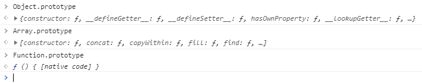
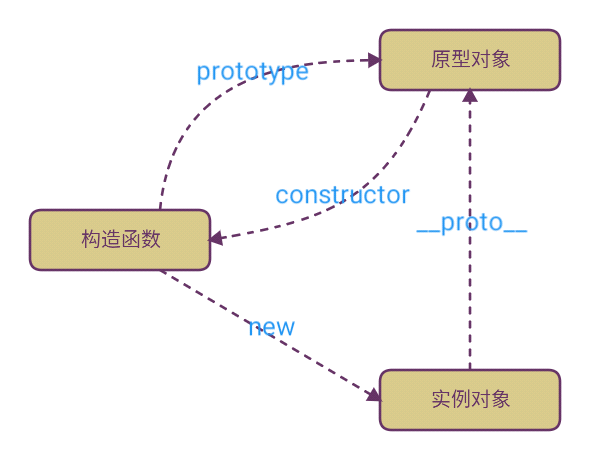
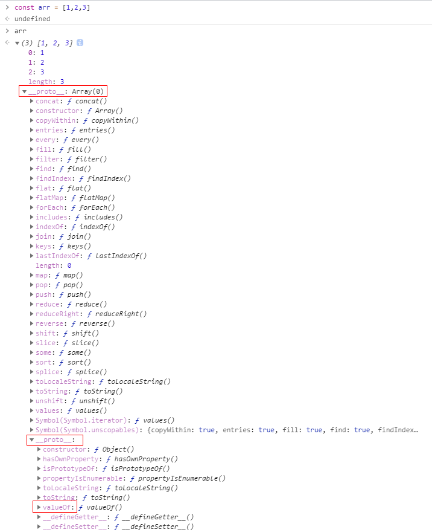

# 【js 进阶】八分钟搞懂 JavaScript 中的 原型（prototype）、原型链、继承

## 前言

大家好，我是雪月。这篇文章主要讲`原型（prototype）`、`原型链` 和 `原型继承`。

## 开始（四个概念、一个例外、三个方法）

- 每个`引用类型`都有`对象特征`，都可以`自由扩展`属性
- 每个`引用类型`都有一个`__proto__`属性，并且指向它的`构造函数`的`prototype`原型对象
- 每个`构造函数`都有一个`prototype`原型对象
- 每个`构造函数`的`prototype`原型对象里的`constructor`指向`构造函数`本身
- 例外：`Object.create(null)` 新建的对象没有`__proto__`属性
- 使用 `hasOwnProperty()` 来检查对象自身中是否含有该属性
- 使用 `in` 检查对象中是否含有某个属性时，如果对象中没有但是原型链中有，也会返回 `true`
- 使用 `instanceof` 运算符测试构造函数的 `prototype` 属性是否出现在对象原型链中

### 概念一

- 每个`引用类型`都有`对象特征`，都可以`自由扩展`属性

```js
const obj = {}
const arr = []
const fn = function () {}

obj.a = 1
arr.b = 2
fn.c = 3

console.log(obj.a) // 1
console.log(arr.b) // 2
console.log(fn.c) // 3
```

### 概念二

- 每个`引用类型`都有一个`__proto__`属性，并且指向它的`构造函数`的`prototype`原型对象

```js
const obj = {}
const arr = []
const fn = function () {}

obj.__proto__ === Object.prototype // true
arr.__proto__ === Array.prototype // true
fn.__proto__ === Function.prototype // true
```

### 概念三

- 每个`构造函数`都有一个`prototype`原型对象

```js
const { log } = console

log(Object.prototype)
log(Array.prototype)
log(Function.prototype)
```



### 概念四

- 每个`构造函数`的`prototype`原型对象里的`constructor`指向`构造函数`本身

```js
Object.prototype.constructor === Object // true
Array.prototype.constructor === Array // true
Function.prototype.constructor === Function // true
```



### 一个例外

- `Object.create(null)` 新建的对象没有`__proto__`属性

```js
Object.create(null) // {}
// No properties
```

### 三个方法

- 使用 `hasOwnProperty()` 来检查对象自身中是否含有该属性
- 使用 `in` 检查对象中是否含有某个属性时，如果对象中没有但是原型链中有，也会返回 `true`
- 使用 `instanceof` 运算符测试构造函数的 `prototype` 属性是否出现在对象原型链中

> 特别注意：for in 循环仅能访问原型链中 enumerable（可枚举）的属性；
> in 操作符不管是否可枚举

```js
const arr = []
const obj = {
  name: '雪月',
  age: 18,
}
obj.hasOwnProperty('name') // true
obj.hasOwnProperty('age') // true
obj.hasOwnProperty('valueOf') // false

'name' in obj // true
'age' in obj // true
'valueOf' in obj // true
'dddd' in obj // false

arr instanceof Array // true
arr instanceof Object // true
obj instanceof Object // true
obj instanceof Array // false
```

## 原型链

**概念**：当试图访问一个对象（这里的对象指引用类型）的属性时，它不仅仅在该对象上搜寻，还会搜寻该对象的原型，以及该对象的原型的原型，依次层层向上搜索，
直到找到一个名字匹配的属性或到达原型链的末尾

看下面这段代码

```js
const arr = [1, 2, 3]
arr.valueOf() //  [1, 2, 3]
```

再看这张图



**上图的原型链如下**

> arr ---> Array.prototype ---> Object.prototype ---> null

查找`valueOf`大致流程

- 当前实例对象`arr`，查找`arr`的属性或方法，找到后返回
- 没有找到，通过`arr. __proto__`找到`arr`构造函数的`prototype`并且查找属性或方法，找到返回
- 没有找到，把`Array.prototype`当做`arr`，重复以上步骤
- 当到达`Object.prototype.__proto__ === null` 时，查找结束
- 这就是传说中的`原型链`，层层向上查找，最后还没有就返回`undefined`

## 继承

`JavaScript`的继承有很多种方式实现，各有不足之处，下面展开说明：

- 使用 `call` (只能继承属性，无法继承父类原型对象中的方法)
- 借助`原型链` (多个实例使用同一个原型对象)
- 将上面两种`结合` (前面两个问题解决，但父类构造函数会多执行一次)
- `组合继承`的`优化1` (构造函数变成了父类)
- `组合继承`的`优化2` (寄生组合继承) (基本完美)
- 使用 `ES6` 的 `class` 的 `extends`

### 使用 call

> 缺点： 只能继承属性，无法继承父类原型对象中的方法

```js
function Parent() {
  this.name = 'parent'
}
Parent.prototype.show = function () {
  console.log('show')
}
function Child() {
  Parent.call(this)
  this.type = 'child'
}
const c = new Child()

console.log(c) // {name: "parent", type: "child"}
c.show() // Uncaught TypeError: c.show is not a function
```

### 借助原型链

> 缺点： 多个实例使用同一个原型对象

```js
function Parent2() {
  this.name = 'parent2'
  this.play = [1, 2, 3]
}
function Child2() {
  this.type = 'child2'
}
Child2.prototype = new Parent2()

const c2 = new Child2()
console.log(c2) // {type: "child2"}
console.log(c2.name) // parent2
console.log(c2.play) // [1, 2, 3]
```

看似没有问题，父类的方法和属性都能够访问，但实际上有一个潜在的不足。举个例子：

```js
const c21 = new Child2()
const c22 = new Child2()
c21.play.push(4)
console.log(c22.play) // [1, 2, 3, 4]
console.log(c21.play === c22.play) // true

// 因为两个实例使用的是同一个原型对象, 所以改变c21的play属性，c22的play属性也跟着变了
```

### 将上面两种结合

> 缺点：前面两个问题解决，但父类构造函数会多执行一次

```js
function Parent3() {
  this.name = 'parent3'
  this.play = [1, 2, 3]
}
function Child3() {
  Parent3.call(this)
  this.type = 'child3'
}
Child3.prototype = new Parent3()

const c31 = new Child3()
const c32 = new Child3()
c31.play.push(4)

console.log(c31.play) // [1, 2, 3, 4]
console.log(c32.play) // [1, 2, 3]
```

### 组合继承的优化 1

> 缺点：构造函数变成了父类

这里让将父类原型对象直接给到子类，父类构造函数只执行一次，而且父类属性和方法均能访问，但是子类实例的构造函数是 Parent4，显然这是不对的，应该是 Child4

```js
function Parent4() {
  this.name = 'parent4'
  this.play = [1, 2, 3]
}
function Child4() {
  Parent4.call(this)
  this.type = 'child4'
}
Child4.prototype = Parent4.prototype

var c41 = new Child4()
console.log(c41)
```

### 组合继承的优化 2 (寄生组合继承)

> 缺点：基本完美

```js
function Parent5() {
  this.name = 'parent5'
  this.play = [1, 2, 3]
}
function Child5() {
  Parent5.call(this)
  this.type = 'child5'
}
Child5.prototype = Object.create(Parent5.prototype)
Child5.prototype.constructor = Child5

const c51 = new Child5()
console.log(c51)
```

### 使用 ES6 的 class 的 extends

```js
class Parent6 {
	constructor(name, age, school) {
		this.name = name
		this.age = age
		this.school = school || '斗罗大陆'
	}
	show() {
		console.log(this.name + this.age + '岁，' + '在' + this.school)
	}
}

class Child6 extends Parent6 {
	constructor(name, age, school) {
		super(name, age, school)
	}
}

const c61 = new Parent6('小明', 18, '五道口职业技术学院')
const c62 = new Child6('小华', 20, '北京大学')
const c63 = new Child6('小三', 22)
c61.show() // 小明18岁，在五道口职业技术学院
c62.show() // 小华20岁，在北京大学
c63.show() // 小三22岁，在斗罗大陆
```

## 结束

本文从`四个概念`、`一个例外`、`三个方法`出发，让大家深入理解 `JavaScript` 中的 `原型（prototype）`，从而引申出`原型链`的概念，总结了 6 个`继承`的方法。感谢阅读^\_^
