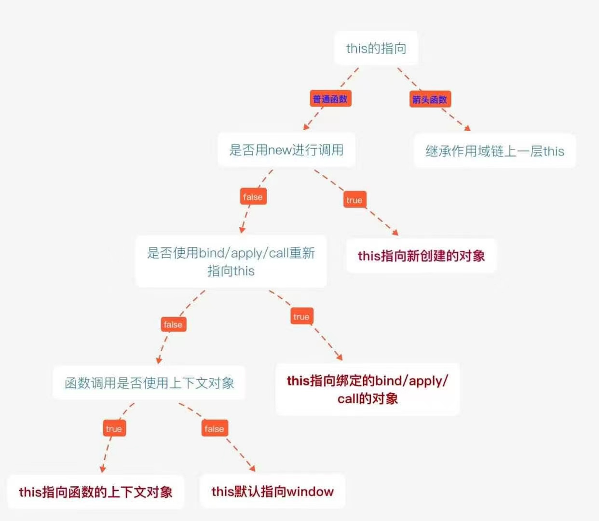

# 【js 进阶】三分钟搞懂 JavaScript 中的 this 指向问题

## 前言

本文采用`总分总`的方式叙事:

## 总结

如果要判断一个运行中函数的 `this` 绑定，就需要找到这个函数的直接调用位置。找到之后就可以顺序应用下面这四条规则来判断 `this` 的绑定对象

1. 由 `new` 调用？绑定到新创建的对象

2. 由 `call` 或者 `apply`（或者 `bind`）调用？绑定到指定的对象

3. 由上下文对象调用？绑定到那个`上下文对象`

4. 默认：在严格模式下绑定到 `undefined`，否则绑定到`全局对象`

5. `ES6` 中的箭头函数，继承外层函数调用的 `this` 绑定

一图胜千言：



## 展开说明

下面将用伪代码验证总结的正确性

### 由 `new` 调用？绑定到新创建的对象

我们顺便回忆一下 `new` 操作做了什么？

- 创建（或者说构造）一个全新的对象
- 这个新对象会被执行 `[[prototype]]` 连接
- 这个新对象会绑定到函数调用的 `this`
- 如果函数没有返回其他对象，那么 `new` 表达式中的函数调用会自动返回这个新对象

```js
function Man(n, a) {
  this.name = n
  this.age = a
}
const xueyue = new Man('雪月', 18)
console.log(xueyue.name) // 雪月
console.log(xueyue.age) // 18
```

### 由 `call` 或者 `apply`（或者 `bind`）调用？绑定到指定的对象

```js
const { log } = console
const name = '雪月'
const age = 18
const obj = {
  name: '安妮',
  objAge: this.age,
  fun: function (like, dislike) {
    log(this.objAge)
    log(this.name + '今年' + this.age + '岁', '喜欢' + like + '不喜欢' + dislike)
  },
}
const a = { name: '飞虎队', age: 19 }
const b = { name: '夜玫瑰', age: 20 }
const c = { name: '复仇者', age: 21 }
obj.fun.call(a, '雷神', '黑龙') // undefined  飞虎队今年19岁 喜欢雷神不喜欢黑龙
obj.fun.apply(b, ['火麒麟', '无影']) // undefined  夜玫瑰今年20岁 喜欢火麒麟不喜欢无影
obj.fun.bind(c, '巴雷特', 'AWM')() // undefined  复仇者今年21岁 喜欢巴雷特不喜欢AWM
```

### 由上下文对象调用？绑定到那个`上下文对象`

第三方库的许多函数，以及 `JavaScript` 语言和宿主环境中许多新的内置函数，都提供了一个可选的参数，通常被称为`上下文（context）`，其作用和 `bind(..)` 一样，
确保你的回调函数使用指定的 `this`

```js
function foo(el) {
  console.log(el, this.id)
}
var obj = {
  id: 'awesome',
}
// 调用 foo(..) 时把 this 绑定到 obj
;[1, 2, 3].forEach(foo, obj)
// 1 awesome
// 2 awesome
// 3 awesome
```

### 默认：在严格模式下绑定到 `undefined`，否则绑定到`全局对象`

```js
function foo() {
  console.log(this.a)
}
a = 666
foo() // 666
```

```js
function foo() {
  'use strict'
  console.log(this.a)
}
a = 666
foo() // TypeError: Cannot read property 'a' of undefined
```

> 特殊提示： 如果你把 null 或者 undefined 作为 this 的绑定对象传入 call、apply 或者 bind，
> 这些值在调用时会被忽略，实际应用的是默认绑定规则：

```js
function foo() {
  console.log(this.a)
}
var a = 2
foo.call(null) // 2
```

那么什么情况下你会传入 `null` 呢？

一种非常常见的做法是使用 `apply(..)` 来 `“展开”` 一个数组，并当作参数传入一个函数。类似地，`bind(..)` 可以对参数进行柯里化（预先设置一些参数），这种方法有时非常有用

```js
function foo(a, b) {
  console.log('a:' + a + ', b:' + b)
}

// 把数组 展开 成参数
foo.apply(null, [2, 3]) // a:2, b:3

// 使用 bind(..) 进行柯里化
var bar = foo.bind(null, 2)
bar(3) // a:2, b:3
```

然而，总是使用 `null` 来忽略 `this` 绑定可能产生一些副作用。如果某个函数确实使用了`this`（比如第三方库中的一个函数），那默认绑定规则会把 `this` 绑定到全局对象（在浏览
器中这个对象是 `window`），这将导致不可预计的后果（比如修改全局对象）。

显而易见，这种方式可能会导致许多难以分析和追踪的 `bug`

一种“更安全”的做法是传入一个特殊的对象(`DMZ`空对象)，把 `this` 绑定到这个对象不会对你的程序产生任何副作用

```js
function foo(a, b) {
  console.log('a:' + a + ', b:' + b)
}

// 我们的 DMZ 空对象
var _dmz = Object.create(null)

// 把数组展开成参数
foo.apply(_dmz, [2, 3]) // a:2, b:3

// 使用 bind(..) 进行柯里化
var bar = foo.bind(_dmz, 2)
bar(3) // a:2, b:3
```

### `ES6` 中的箭头函数，继承外层函数调用的 `this` 绑定

```js
function foo() {
  setTimeout(() => {
    // 这里的 this 在此法上继承自 foo()
    console.log(this.a)
  }, 100)
}

var obj = {
  a: 18,
}

foo.call(obj) // 18
```

等同于下面的 `ES5`

```js
function foo() {
  var self = this // lexical capture of this
  setTimeout(function () {
    console.log(self.a)
  }, 100)
}

var obj = {
  a: 18,
}

foo.call(obj) // 18
```

## 结束

做道题检验一下

```js
function Parent() {
  this.a = 1
  this.b = [1, 2, this.a]
  this.c = { demo: 5 }
  this.show = function () {
    console.log(this.a, this.b, this.c.demo)
  }
}

function Child() {
  this.a = 2
  this.change = function () {
    this.b.push(this.a)
    this.a = this.b.length
    this.c.demo = this.a++
  }
}

Child.prototype = new Parent()

var parent = new Parent()
var child1 = new Child()
var child2 = new Child()

child1.a = 11
child2.a = 12

parent.show() // 1 [1, 2, 1] 5
child1.show() // 11 [1, 2, 1] 5
child2.show() // 12 [1, 2, 1] 5

// 这涉及到原型链的知识
child1.change() // b = [1, 2, 1, 11] a = 5 demo = 4
child2.change() // b = [1, 2, 1, 11, 12] a = 6 demo = 5
parent.show() // 1 [1, 2, 1] 5
child1.show() // 5 [1, 2, 1, 11, 12] 5
child2.show() // 6 [1, 2, 1, 11, 12] 5
```
